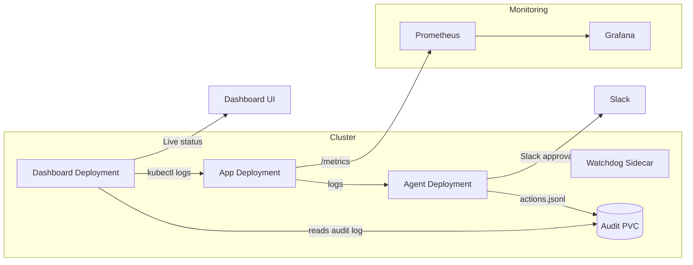

# Auto-Ops Agent


Auto-Ops is a self-healing Kubernetes agent designed to automate incident response and remediation in cloud-native environments. It continuously monitors application logs, leverages LLM-assisted reasoning to detect and diagnose issues, and executes safe remediation actions with human-in-the-loop approvals via Slack. The system is built for reliability, transparency, and demo-ready storytelling, with a live dashboard that visualizes system state, decisions, and log activity.

### Key Features

- **Autonomous Log Analysis:** Continuously tails logs from application deployments, looking for error patterns, anomalies, or signals of unhealthy behavior.
- **LLM-Driven Diagnosis:** Integrates with a Large Language Model (LLM) to interpret log events, correlate symptoms, and suggest context-aware remediation steps.
- **Human-in-the-Loop Approvals:** All remediation actions require explicit approval via Slack, ensuring safety and auditability.
- **Automated Remediation:** Executes safe, predefined actions (e.g., pod restarts, scaling, or custom scripts) after approval.
- **Unified Audit Trail:** Every decision, approval, and action is logged to a shared audit file, enabling traceability and compliance.
- **Live Dashboard:** Real-time UI shows system health, recent incidents, audit history, and live log tail for demo storytelling.
- **Monitoring Integration:** Exposes Prometheus metrics and integrates with Grafana for advanced observability.

---


## How It Works

### 1. Log Monitoring & Event Detection
The agent runs as a Kubernetes deployment and continuously tails logs from the main application pods. It parses log lines in real time, using pattern matching and heuristics to detect errors, warnings, or anomalous behavior. When a suspicious event is found, it triggers the diagnosis pipeline.

### 2. LLM-Assisted Reasoning & Diagnosis
Detected incidents are summarized and sent to an LLM (such as OpenAI or a self-hosted model) along with recent log context. The LLM analyzes the situation, infers likely root causes, and recommends a remediation action from a set of safe, predefined options (e.g., restart deployment, scale up, clear cache). The agent ensures only actions from an approved allowlist are considered.

### 3. Approval Workflow via Slack
The agent posts a detailed approval request to a configured Slack channel, including the incident summary, recommended action, and relevant logs. Team members can approve or reject the action directly from Slack using interactive buttons. The agent exposes a callback server to receive Slack approval events securely.

### 4. Automated Remediation
Once approved, the agent executes the remediation action in the cluster using the Kubernetes API. Actions are idempotent and designed to be safe for repeated execution. The agent logs the outcome (success/failure) and any follow-up observations.

### 5. Unified Audit Log & Dashboard
All decisions, approvals, and actions are appended to a shared audit log (JSONL format) stored on a PersistentVolumeClaim (PVC). The dashboard reads this log to display a live timeline of incidents, actions, and approvals. It also shows the current system state, recent log tail, and metrics for demo storytelling.

### 6. Monitoring & Observability
The agent and app expose Prometheus metrics for health, incident counts, and action outcomes. Grafana dashboards provide historical trends and alerting. The dashboard UI offers a live view for demos and incident reviews.

---

## Technical Details

- **Agent Internals:**
  - Written in Node.js, the agent uses Kubernetes client libraries to watch logs and manage resources.
  - LLM integration is abstracted for easy swapping between providers.
  - Slack callback server is secured with signing secrets and supports ngrok/localtunnel for development.
  - Audit log is a line-delimited JSON file, with each entry containing timestamp, event type, details, and references to logs/actions.

- **Dashboard:**
  - Polls the audit log and app logs every few seconds for live updates.
  - Visualizes incident timeline, approval status, and remediation history.
  - Provides endpoints for status and log tailing.

- **Audit Log Example Entry:**
  ```json
  {
    "timestamp": "2026-05-26T12:34:56Z",
    "event": "remediation_proposed",
    "summary": "CrashLoopBackOff detected in app pod",
    "recommendation": "restart deployment",
    "llm_reasoning": "Pod entered CrashLoopBackOff after repeated errors. Restart is safe.",
    "slack_message_id": "...",
    "status": "pending"
  }
  ```

---

This workflow enables teams to respond to incidents faster, reduce manual toil, and build confidence in automated operations—while always keeping a human in the loop for safety.

> Replace the inline GIF above with your recorded demo (30-45 seconds) once you capture it.

## Architecture



## One-command demo

```bash
make demo
```

What this does:
- Creates a kind cluster if missing
- Builds and loads all Docker images
- Deploys Prometheus, Grafana, agent, app, and dashboard
- Waits for pods to be ready
- Prints the dashboard and chaos URLs

## Dashboard

- NodePort: `http://localhost:30080`
- API endpoint: `/api/status` (polls every 3 seconds)
- Reads audit data from the shared audit PVC
- Tail logs are collected via `kubectl logs deployment/app-deployment --tail=20` on each poll

## Chaos and demo flow

1. Open the dashboard and Slack side-by-side.
2. Trigger chaos:
   ```bash
   curl http://localhost:30000/chaos/errors
   ```
3. Watch agent logs detect the issue.
4. Approve the Slack action.
5. Watch pods restart.
6. Watch dashboard update with the latest decision.

## Secrets setup

Create the secret before running the demo so Slack approvals and LLM calls work:

```bash
./scripts/create-sealed-secret.sh \
  'INCEPTION_API_KEY' \
  'SLACK_WEBHOOK_URL' \
  'SLACK_SIGNING_SECRET' \
  'SLACK_BOT_TOKEN'

kubectl apply -f ops/sealed-secret.yaml
```


## Port Forwarding & Local Access

To run the demo and access all components locally, you need to set up several port-forwards in separate terminals. These allow your local machine to interact with services running inside the Kubernetes cluster, and enable external integrations like Slack callbacks.

### Required Port-Forwards

Run each of these commands in a separate terminal:

```bash
# Forward the app API to localhost:3000
kubectl port-forward svc/app-service 3000:3000

# Forward the agent callback server to localhost:3001
kubectl port-forward svc/agent-callback 3001:3001

# Forward the dashboard UI to localhost:8080
kubectl port-forward svc/dashboard-service 8080:8080

# (Optional, for Slack integration) Expose the agent callback externally using ngrok
/tmp/ngrok http 3001
```

### Why These Forwards?

- **App Service (3000:3000):**
  - Exposes the main application API on your local machine at http://localhost:3000. This is used for chaos testing and demo interactions.
- **Agent Callback (3001:3001):**
  - Exposes the agent's Slack callback server on http://localhost:3001. Slack needs to reach this endpoint to deliver approval events. For local development, you must also expose this port to the internet (see ngrok below).
- **Dashboard Service (8080:8080):**
  - Exposes the dashboard UI on http://localhost:8080. Use this to view live system state, incidents, and logs.
- **ngrok (http 3001):**
  - Creates a public HTTPS tunnel to your local agent callback server. Slack requires a public URL to send interactive event payloads. After running ngrok, update your Slack app's interactivity/callback URL to the generated ngrok URL (e.g., https://xxxx.ngrok.io).

> **Tip:** Each port-forward must run in its own terminal window. If you close a terminal, the forward will stop.

---
## Troubleshooting

- **Dashboard shows no decisions**: the dashboard pod must mount the same audit PVC used by the agent. Verify with:
  ```bash
  kubectl describe pod -l app=dashboard | grep -A2 audit-pvc
  ```

- **Slack approvals not working**: update your ngrok URL in Slack interactivity settings and ensure the callback server is running:
  ```bash
  kubectl logs deployment/agent-deployment | grep -i "callback server"
  ```

- **No live log tail**: confirm the dashboard service account can read pod logs and the app deployment exists:
  ```bash
  kubectl get pods -l app=my-app
  kubectl logs deployment/app-deployment --tail=20
  ```

- **Prometheus/Grafana not reachable**: use port forwarding if needed:
  ```bash
  kubectl port-forward -n monitoring svc/prometheus-kube-prometheus-prometheus 9090:9090
  kubectl port-forward -n monitoring svc/grafana 3000:80
  ```

## Record the demo GIF

- Open the dashboard and Slack in split view.
- Trigger `/chaos/errors` and capture the full loop (30-45 seconds).
- Convert to GIF with a tool like ezgif.com.
- Replace the inline GIF at the top of this README.
