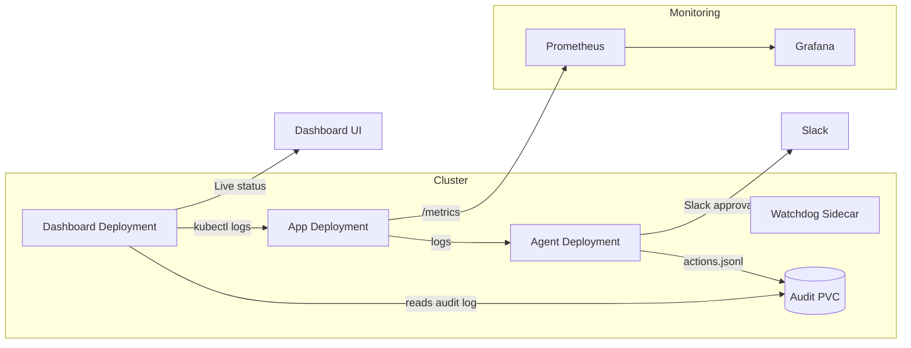

# Auto-Ops Agent


Auto-Ops is a self-healing Kubernetes agent that watches application logs, uses LLM-assisted reasoning, and executes safe remediation actions with Slack approvals. The dashboard provides a live view of the system state, decisions, and app log tail for demo-ready storytelling.

> Replace the inline GIF above with your recorded demo (30-45 seconds) once you capture it.

## Architecture



## One-command demo

```bash
make demo
```

What this does:
- Creates a kind cluster if missing
- Builds and loads all Docker images
- Deploys Prometheus, Grafana, agent, app, and dashboard
- Waits for pods to be ready
- Prints the dashboard and chaos URLs

## Dashboard

- NodePort: `http://localhost:30080`
- API endpoint: `/api/status` (polls every 3 seconds)
- Reads audit data from the shared audit PVC
- Tail logs are collected via `kubectl logs deployment/app-deployment --tail=20` on each poll

## Chaos and demo flow

1. Open the dashboard and Slack side-by-side.
2. Trigger chaos:
   ```bash
   curl http://localhost:30000/chaos/errors
   ```
3. Watch agent logs detect the issue.
4. Approve the Slack action.
5. Watch pods restart.
6. Watch dashboard update with the latest decision.

## Secrets setup

Create the secret before running the demo so Slack approvals and LLM calls work:

```bash
./scripts/create-sealed-secret.sh \
  'INCEPTION_API_KEY' \
  'SLACK_WEBHOOK_URL' \
  'SLACK_SIGNING_SECRET' \
  'SLACK_BOT_TOKEN'

kubectl apply -f ops/sealed-secret.yaml
```

## Troubleshooting

- **Dashboard shows no decisions**: the dashboard pod must mount the same audit PVC used by the agent. Verify with:
  ```bash
  kubectl describe pod -l app=dashboard | grep -A2 audit-pvc
  ```

- **Slack approvals not working**: update your ngrok URL in Slack interactivity settings and ensure the callback server is running:
  ```bash
  kubectl logs deployment/agent-deployment | grep -i "callback server"
  ```

- **No live log tail**: confirm the dashboard service account can read pod logs and the app deployment exists:
  ```bash
  kubectl get pods -l app=my-app
  kubectl logs deployment/app-deployment --tail=20
  ```

- **Prometheus/Grafana not reachable**: use port forwarding if needed:
  ```bash
  kubectl port-forward -n monitoring svc/prometheus-kube-prometheus-prometheus 9090:9090
  kubectl port-forward -n monitoring svc/grafana 3000:80
  ```

## Record the demo GIF

- Open the dashboard and Slack in split view.
- Trigger `/chaos/errors` and capture the full loop (30-45 seconds).
- Convert to GIF with a tool like ezgif.com.
- Replace the inline GIF at the top of this README.
